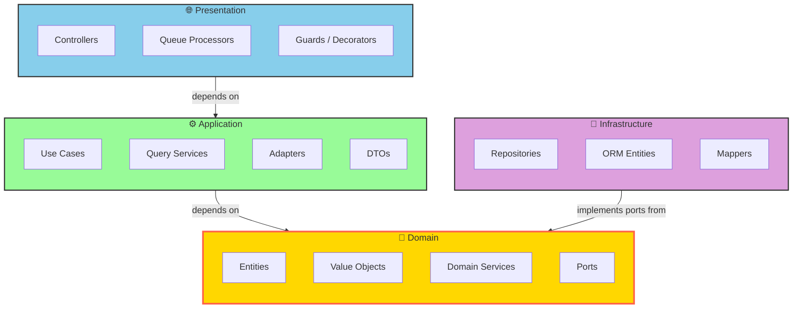
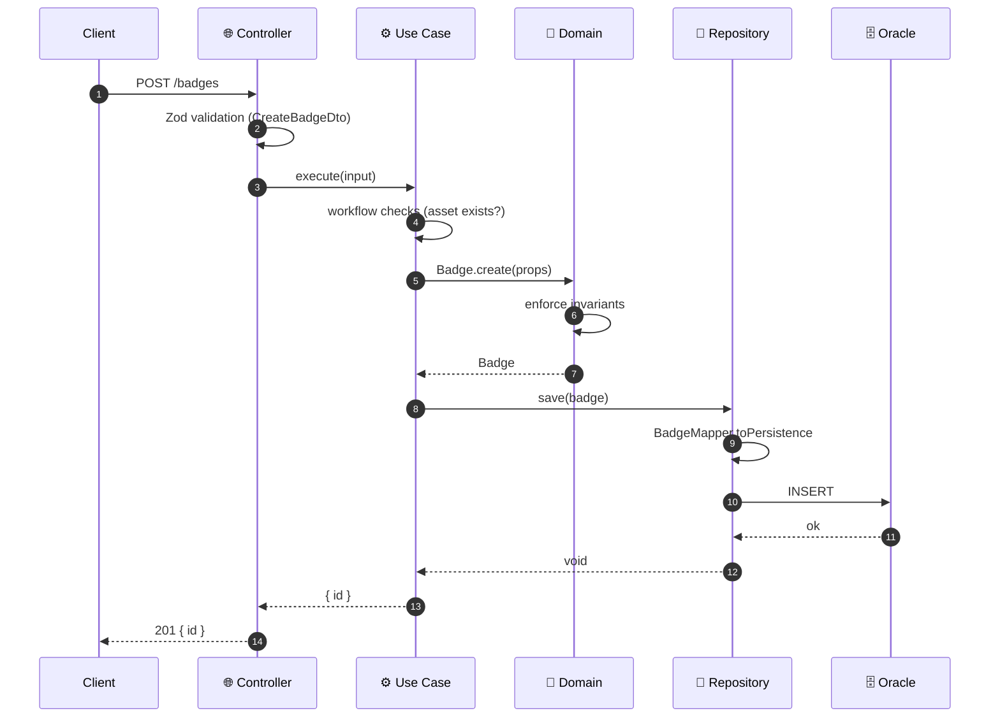
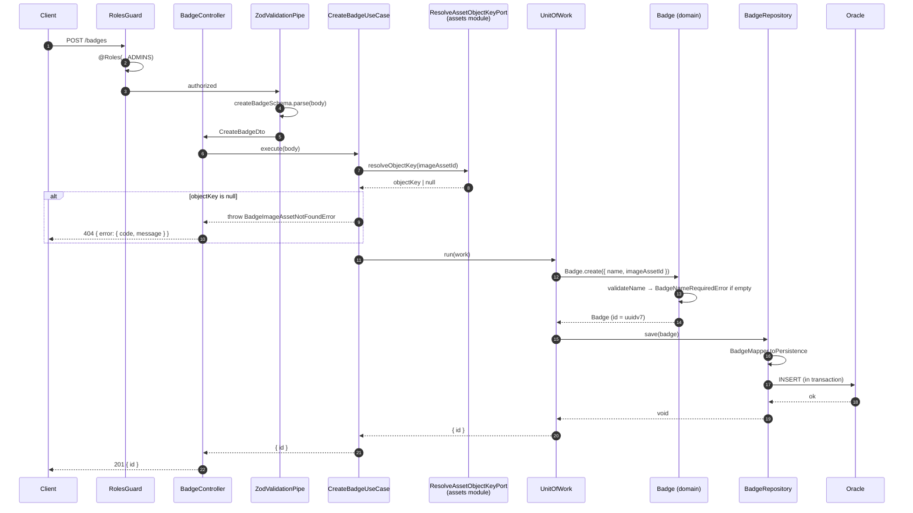

# Architecture & Concepts

This handbook is the conceptual guide to `apps/api` — a **Module-First Clean Architecture** backend built on NestJS 11, TypeORM 1.0 (Oracle 19c) and Zod.

It explains *why* the code is shaped the way it is. For the terse rule list, read `apps/api/AGENTS.md`. For judgment calls on a specific change, read `docs/guideline/api-architecture.md`. For port/adapter mechanics, read `docs/guideline/ports-and-adapters.md`.

---

## Table of Contents

1. [Overview](#1-overview)
2. [Project Structure](#2-project-structure)
3. [Clean Architecture Principles](#3-clean-architecture-principles)
4. [The Four Layers Explained](#4-the-four-layers-explained)
5. [Deep Dive: Ports & Adapters](#5-deep-dive-ports--adapters)
6. [Cross-Cutting Concerns & Shared Kernel](#6-cross-cutting-concerns--shared-kernel)
7. [Dependency Injection](#7-dependency-injection)
8. [Complete Example: Create Badge](#8-complete-example-create-badge)
9. [Testing Strategy](#9-testing-strategy)
10. [Technology Stack](#10-technology-stack)
11. [Advanced Patterns & Best Practices](#11-advanced-patterns--best-practices)
12. [Enforcement](#12-enforcement)

---

## 1. Overview

This project uses **Module-First Clean Architecture**:

- **Module-First**: code is organized by business capability (`achievements`, `learning-content`, `personalize`, `users`) rather than by technical role (`controllers/`, `services/`, `models/`).
- **Clean Architecture**: every module internally follows the same four layers with strict dependency rules.

### Why Module-First?

Organizing by technical layer scatters a single feature across the tree. Adding a field to a badge means touching `controllers/badge.ts`, `services/badge.ts`, `models/badge.ts`, `dtos/badge.ts` — four directories, none of which tell you they belong together.

Organizing by module keeps a capability in one place:

```text
src/modules/achievements/     ← everything about achievements lives here
├── domain/                   ← business rules
├── application/              ← use cases, DTOs, adapters, query services
├── infrastructure/           ← TypeORM repositories, mappers, ORM entities
├── presentation/             ← HTTP controllers
├── achievement.module.ts     ← the DI wiring
└── index.ts                  ← the public contract other modules may import
```

The benefits compound:

| Benefit | How module-first delivers it |
|---|---|
| **Navigability** | The folder listing of `src/modules/` *is* the capability list of the product. |
| **Blast radius** | A change to achievements can only break achievements — unless it crosses a port, which is explicit and greppable. |
| **Parallel work** | Two people on two modules rarely touch the same file. |
| **Extraction** | A module with a clean port surface can move to its own deployable without rewriting its internals. |
| **Deletion** | Killing a feature is `rm -rf` on one directory plus removing one import. |

### Bounded Contexts

Some capabilities are large enough that a single module would be unwieldy. Those become a **bounded context** — a directory holding several submodules that share domain language:

```text
src/modules/learning-content/     ← bounded context
├── shared/domain/                ← primitives shared by all submodules in this context
├── courses/                      ← submodule, has its own 4 layers
├── learning-goals/
├── learning-paths/
├── media/
├── application/                  ← context-level use cases spanning submodules
└── presentation/
```

Submodules inside one bounded context may share `shared/domain/` primitives and import each other's `application/query-port/` contracts directly. They still may **not** reach into each other's `infrastructure/` or `presentation/`. Everything outside the context talks to it through published ports only.

---

## 2. Project Structure

```text
apps/api/
├── src/
│   ├── main.ts                     # HTTP bootstrap
│   ├── worker.ts                   # BullMQ worker bootstrap
│   ├── outbox-relay.ts             # outbox relay bootstrap
│   ├── app.module.ts               # root module — composes feature modules
│   │
│   ├── modules/                    # ← business capabilities
│   │   ├── achievements/
│   │   ├── admin/
│   │   ├── assets/
│   │   ├── auth/
│   │   ├── channel-directory/
│   │   ├── content-approvals/
│   │   ├── creator-channel/
│   │   ├── health/
│   │   ├── learning-content/       # bounded context
│   │   ├── livestreams/
│   │   ├── moderation/
│   │   ├── personalize/
│   │   ├── uploads/
│   │   ├── user-activities/
│   │   └── users/
│   │
│   ├── shared/                     # ← shared kernel: importable by any module
│   │   ├── auth/        cache/     common/      config/
│   │   ├── database/    decorators/ domain/     errors/
│   │   ├── filters/     guards/    http/        interceptors/
│   │   ├── outbox/      pipes/     security/    storage/     utils/
│   │
│   └── infrastructure/             # ← process-wide technical adapters
│       ├── auth/ cache/ logger/ object-storage/
│       └── outbox/ queue/ tracing/ typeorm/
│
├── migrations/                     # TypeORM-generated, never hand-written
├── test/e2e/features/              # Gherkin acceptance specs
├── docs/                           # this handbook and friends
├── .dependency-cruiser.cjs         # import-boundary enforcement
└── sgconfig.yml                    # ast-grep code-shape enforcement
```

### Anatomy of a Module

```text
src/modules/achievements/
│
├── domain/                                  💎 pure TypeScript, zero frameworks
│   ├── entity/badge.entity.ts
│   ├── value-object/achievement-status.vo.ts
│   ├── service/badge-edit-policy.ts
│   ├── port/badge-repository.port.ts        # internal persistence contract
│   ├── port/has-earned-badge.port.ts        # published cross-module contract
│   ├── types/<port-name>.types.ts           # port inputs / results / views
│   └── achievement.errors.ts
│
├── application/                             ⚙️ orchestration
│   ├── use-cases/create-badge.use-case.ts
│   ├── query-port/find-x.query-port.ts      # narrow read contracts (internal)
│   ├── query-service/x.query-service.ts     # read projections, ORM allowed
│   ├── adapter/achievement-badge.adapter.ts # implements published ports
│   ├── dto/request/  dto/response/
│   └── achievement.errors.ts
│
├── infrastructure/                          🔧 concrete technology
│   ├── entity/badge.orm-entity.ts
│   ├── mapper/badge.mapper.ts
│   └── repository/badge.repository.ts
│
├── presentation/                            🌐 HTTP
│   └── badge.controller.ts
│
├── achievement.module.ts                    # DI wiring
└── index.ts                                 # public barrel
```

### Key Directories Explained

| Directory | Holds | Rule of thumb |
|---|---|---|
| `domain/entity/` | Aggregates with identity and behavior | Classes with private fields, static factories, `getValue()` |
| `domain/value-object/` | Immutable concepts without identity | `LearningPathStatusVO`, `AchievementCriteria` |
| `domain/service/` | Rules that coordinate several entities/VOs | `BadgeEditPolicy`, `AchievementMetricCatalog` |
| `domain/port/` | Abstract classes used as DI tokens | `*RepositoryPort` internal; everything else may be published |
| `domain/types/` | Input/result/view types for ports | Keeps port files to the abstract class alone |
| `application/use-cases/` | One workflow each, one public `execute()` | Injects ports, never ORM |
| `application/query-port/` | Narrow read contract for one use case | Named `*Query`, returns `Projection` |
| `application/query-service/` | Read implementations | Named `*QueryService`, may use TypeORM directly |
| `application/adapter/` | Implementations of published ports | May use TypeORM; never imported by controllers |
| `infrastructure/entity/` | TypeORM entities, singular class names | `BadgeOrmEntity`, `CourseOrmEntity` |
| `infrastructure/mapper/` | ORM row ⇄ domain object | Pure functions, no I/O |
| `infrastructure/repository/` | Command-side persistence | Returns domain entities or `void` |
| `presentation/` | Controllers, processors, decorators | HTTP/session/validation only |

---

## 3. Clean Architecture Principles

Clean Architecture rests on one rule:

### The Dependency Rule

> **Dependencies only point inward. Inner layers know nothing about outer layers.**



Note the direction of the infrastructure arrow. Infrastructure is an *outer* layer, yet it depends *inward* on the domain — because the domain owns the interface (`BadgeRepositoryPort`) and infrastructure supplies the implementation (`BadgeRepository`). This inversion is what lets us swap Oracle for anything else without the domain noticing.

### The Complete Flow of Control



Control flows outside → inside → outside. Dependencies point only inward. Those are two different arrows, and confusing them is the most common architectural mistake.

### Layer Responsibilities

#### 🌐 Presentation Layer

**Job:** translate HTTP (or a queue message) into a use-case call, and a use-case result into a response.

Does:
- Route definition, HTTP verbs, status codes
- Input validation of route params, query params and bodies via Zod DTOs
- Auth guards (`@Roles`), session extraction, correlation
- OpenAPI annotations (`@ApiOkResponse`, examples)
- Tracing (`@Traced()`)

Does **not**:
- Contain business rules of any kind
- Call query services, repositories or adapters directly
- Catch domain errors to translate them — exception filters do that

```typescript
@Post()
@Roles(...RoleGroup.ADMINS)
@HttpCode(HttpStatus.CREATED)
@ApiBody({ type: CreateBadgeDto, examples: { default: { summary: "Create badge", value: BADGE_EXAMPLE } } })
@ApiCreatedResponse({ type: CreateBadgeResponseDto })
@Traced()
create(@Body() body: CreateBadgeDto): Promise<BadgeIdResponse> {
  return this.createBadgeUseCase.execute(body);
}
```

Notice how little there is. A controller method that is more than a few lines is usually holding a workflow decision that belongs in the use case.

#### ⚙️ Application Layer

**Job:** orchestrate one workflow. Decide *what happens in what order*; delegate *what is allowed* to the domain and *how it is stored* to ports.

Does:
- Sequence domain calls and port calls
- Own transaction boundaries via `UnitOfWork`
- Make **workflow decisions**: authorization context, duplicate input, empty input, invalid workflow state, not-found → error mapping
- Emit domain events / outbox records
- Implement published ports (in `adapter/`)
- Assemble read projections (in `query-service/`)

Does **not**:
- Duplicate business invariants that belong on an entity
- Import a sibling module's `application/`, `infrastructure/` or `presentation/`
- Import TypeORM — *except* in `query-service/` and `adapter/`, which are explicitly exempted because projecting reads and implementing cross-module ports legitimately need queries

```typescript
@Injectable()
export class CreateBadgeUseCase {
  constructor(
    private readonly badgeRepo: BadgeRepositoryPort,
    private readonly resolveAssetObjectKeyPort: ResolveAssetObjectKeyPort,
    private readonly uow: UnitOfWork,
  ) {}

  async execute(input: CreateBadgeInput): Promise<{ id: string }> {
    if (input.imageAssetId) {
      const objectKey = await this.resolveAssetObjectKeyPort.resolveObjectKey(input.imageAssetId);
      if (!objectKey) throw new BadgeImageAssetNotFoundError(input.imageAssetId);
    }

    return this.uow.run(async () => {
      const badge = Badge.create({ name: input.name, imageAssetId: input.imageAssetId ?? null });
      await this.badgeRepo.save(badge);
      return { id: badge.getId() };
    });
  }
}
```

Every dependency here is an abstract class. Nothing in this file knows Oracle exists.

#### 💎 Domain Layer

**Job:** be right about the business, forever, regardless of technology.

Does:
- Enforce invariants at construction and on every mutation
- Model state transitions explicitly
- Express rules in the team's ubiquitous language
- Declare ports (interfaces the outer layers must satisfy)

Does **not**:
- Import `@nestjs/*`, `typeorm`, `oracledb`, `express`, `zod`, `nestjs-zod`, or `nestjs-pino` — enforced by dependency-cruiser
- Import any outer layer of its own module
- Import `src/infrastructure/`
- Own audit fields — `createdAt`/`updatedAt` belong to the ORM

**Entities** are classes, not interfaces, because behavior and invariants must travel with the data:

```typescript
export class Badge {
  private _id: string;
  private _name: string;
  private _imageAssetId: string | null;

  private constructor(props: BadgeProps) {
    Badge.validateName(props.name);          // invariant on every path in
    this._id = props.id;
    this._name = props.name;
    this._imageAssetId = props.imageAssetId;
  }

  static create(props: CreateBadgeProps): Badge {
    return new Badge({ ...props, id: uuidv7() });
  }

  static fromPersistence(props: BadgeProps): Badge {
    return new Badge(props);
  }

  hasImage(): boolean { return this._imageAssetId !== null; }

  update(props: UpdateBadgeProps): void {
    Badge.validateName(props.name);
    this._name = props.name;
    this._imageAssetId = props.imageAssetId;
  }

  getValue(): BadgeProps { /* plain snapshot for mappers */ }

  private static validateName(name: string): void {
    if (!name.trim()) throw new BadgeNameRequiredError();
  }
}
```

Two factories, two intents. `create()` mints a new identity; `fromPersistence()` rebuilds one that already exists. The private constructor means there is no third way in, so `validateName` cannot be bypassed.

`getValue()` exists so mappers can read the whole object without the entity leaking public setters. Never expose fields directly.

**Value objects** encode state machines that would otherwise sprawl across use cases as `if` chains:

```typescript
const LEARNING_PATH_STATUS_TRANSITIONS = {
  [LearningPathStatus.Draft]: {
    [LearningPathStatusAction.Publish]: LearningPathStatus.Published,
  },
  [LearningPathStatus.Published]: {
    [LearningPathStatusAction.Flag]: LearningPathStatus.Flagged,
    [LearningPathStatusAction.Unpublish]: LearningPathStatus.Unpublished,
    [LearningPathStatusAction.Edit]: LearningPathStatus.PendingEdit,
  },
  // ...
} satisfies TransitionMap;
```

The legal transitions live in one table. Adding a status means editing one file, and the compiler finds every gap. Without the VO, this knowledge would be duplicated across every use case that touches status — the shotgun-surgery anti-pattern.

**Domain services** hold rules that coordinate multiple entities and therefore belong to no single one: `BadgeEditPolicy`, `AchievementMetricCatalog`, `LearningPathProgressCalculator`.

#### 🔧 Infrastructure Layer

**Job:** make the ports real.

Does:
- Implement repository ports with TypeORM
- Map ORM rows ⇄ domain objects
- Define ORM entities (singular class names: `BadgeOrmEntity`)
- Honour the ambient transaction

Does **not**:
- Make business or workflow decisions
- Return read projections, DTOs or raw rows from a command repository
- Get imported by `application/` outside of `query-service/` and `adapter/`

```typescript
@Injectable()
export class BadgeRepository implements BadgeRepositoryPort {
  constructor(
    @InjectRepository(BadgeOrmEntity)
    private readonly repository: Repository<BadgeOrmEntity>,
  ) {}

  private get manager(): EntityManager {
    return txEmStorage.getStore() ?? this.repository.manager;
  }

  async findById(id: string): Promise<Badge | null> {
    const orm = await this.manager.findOne(BadgeOrmEntity, { where: { id } });
    return orm ? BadgeMapper.toDomain(orm) : null;
  }

  async save(badge: Badge): Promise<void> {
    await this.manager.save(BadgeOrmEntity, BadgeMapper.toPersistence(badge));
  }
}
```

The `manager` getter is the whole transaction story: if a `UnitOfWork` is running, `txEmStorage` (AsyncLocalStorage) holds its `EntityManager` and every write in the call tree joins that transaction automatically. No transaction parameter is threaded through the use case.

`save()` returns `Promise<void>`. Repositories do not return the entity they just saved — the caller already has it.

**Mappers** are the seam between the two shapes, and they are pure:

```typescript
export const BadgeMapper = {
  toDomain(orm: BadgeOrmEntity): Badge {
    return Badge.fromPersistence({ id: orm.id, name: orm.name, imageAssetId: orm.imageAssetId });
  },

  toPersistence(badge: Badge): BadgeOrmEntity {
    const value = badge.getValue();
    return Object.assign(new BadgeOrmEntity(), { id: value.id, name: value.name, imageAssetId: value.imageAssetId });
  },
};
```

`toDomain` calls `fromPersistence`, not `create`. Persisted data is trusted to already be valid and must keep its existing identity.

### Decision Matrix: Where Does This Code Belong?

Ask what decision the code is making.

| The code decides… | It belongs in | Example |
|---|---|---|
| Whether a business state is legal | Entity / VO / domain service | "A badge must have a non-empty name" |
| Whether a transition is allowed | Value object | "Draft can only go to Published" |
| What order things happen in | Use case | "Check the asset, then create, then save" |
| Whether the caller may do this | Use case (workflow) + guard (transport) | `@Roles(...ADMINS)` plus an actor check |
| That absence is an error | Use case | Query returns `null` → use case throws not-found |
| How data is stored or fetched | Repository / query service | TypeORM calls |
| How a row becomes an object | Mapper | `toDomain` / `toPersistence` |
| How an error becomes a status code | Exception filter | `CATEGORY_TO_HTTP_STATUS` |
| What another module is allowed to see | Port + adapter | `HasEarnedBadgePort` |

### The Dependency Rule in Practice

#### ✅ Allowed

```text
presentation/  → application/         (use cases only)
application/   → domain/
application/query-service/ → infrastructure/, typeorm
application/adapter/       → infrastructure/, typeorm
infrastructure/→ domain/
any module     → src/shared/, src/infrastructure/
any module     → another module's index.ts barrel
same-context submodule → sibling shared/domain/, sibling ORM entity (type-only, from ORM entity files)
```

#### ❌ Forbidden

```text
domain/        → @nestjs/*, typeorm, oracledb, express, zod, nestjs-zod, nestjs-pino
domain/        → application/ | infrastructure/ | presentation/
domain/        → src/infrastructure/
application/   → presentation/
application/   → own infrastructure/     (except query-service/ and adapter/)
application/   → typeorm                 (except query-service/ and adapter/)
module A       → module B's application/ | infrastructure/ | presentation/
module A       → module B's non-barrel files
index.ts       → anything but the Nest module + domain/port/ + domain/types/
index.ts       → any *repository*.port.ts
presentation/  → adapters, query services, repositories
```

Every one of these is a dependency-cruiser rule at **error** severity. They are not style preferences; a violation fails `pnpm lint:arch`.

### Why This Matters

1. **Business-logic independence.** `Badge` and `LearningPathStatusVO` compile without NestJS, without Oracle, without HTTP. The rules survive every framework migration.
2. **Testability.** A use case takes abstract classes; a unit test passes fakes. No database, no container, milliseconds per test.
3. **Replaceability.** Swapping the object store or the ORM touches `infrastructure/` and nothing else. The published ports are the contract, and they do not mention the technology.
4. **Maintainability.** When a rule is wrong, there is exactly one place it lives. When a workflow is wrong, there is exactly one file with `execute()`.
5. **Parallel development.** Ports are agreed first; consumer and provider then build against the abstract class independently.

---

## 4. The Four Layers Explained

### Layer 1: Domain (`domain/`)

| | |
|---|---|
| **Depends on** | Nothing (only other domain code and `@ols/shared` types) |
| **Contains** | Entities, value objects, domain services, ports, port types, domain errors |
| **Framework** | None. Pure TypeScript. |
| **Tests** | Pure unit tests, colocated `*.spec.ts` |

Key constraints:

- No framework, ORM, HTTP or validation-library imports.
- Entities are classes with private fields and private constructors.
- Two factories: `create()` for new identity, `fromPersistence()` for rebuild.
- `getValue()` returns a plain snapshot; fields are never public.
- Method names use domain language and describe business behavior — `hasEarnedBadge()`, not `checkBadgeRecordExists()`.
- Errors extend `DomainError` and name the exact failed condition. `BadgeNameRequiredError`, not `InvalidBadgeError`.
- No `createdAt` / `updatedAt`.

Why classes and not interfaces? An interface is a shape; an entity is a shape **plus the rules that keep it valid**. `Badge` as an interface would let any caller construct `{ name: "" }`. As a class with a private constructor, that state is unrepresentable.

### Layer 2: Application (`application/`)

| | |
|---|---|
| **Depends on** | Own `domain/`, other modules' barrels, `src/shared/`, `src/infrastructure/` |
| **Contains** | Use cases, query ports, query services, adapters, DTOs, application errors |
| **Framework** | NestJS DI. TypeORM only in `query-service/` and `adapter/`. |
| **Tests** | Vitest unit specs with fake ports |

**Use case pattern** — one workflow, one public method:

```typescript
@Injectable()
export class XUseCase {
  constructor(private readonly deps: AbstractPort...) {}
  async execute(input: XInput): Promise<XOutput> { /* orchestrate */ }
}
```

Rules:

- Inject the **narrowest** contract that does the job. A use case that needs one read injects `FindLearningPathProgressQuery`, not the whole query service.
- Wrap multi-write workflows in `uow.run()`. A single `repository.save()` is atomic on its own and needs no `UnitOfWork`.
- Throw `ApplicationError` subclasses for workflow failures; let `DomainError` from entities propagate untouched.
- Application errors live in `application/*.errors.ts`; domain errors in `domain/*.errors.ts`. Neither knows about HTTP.

**Query services** are the read side. They exist because a response DTO is usually not a domain entity — it has joins, audit fields, pagination and cross-module composition that no aggregate should carry.

```typescript
export abstract class FindLearningPathProgressQuery {
  abstract findByUserAndLearningPath(
    userId: string,
    learningPathId: string,
  ): Promise<LearningPathProgressProjection | null>;
}
```

The abstract class is the DI token; the `*QueryService` implementation may hit TypeORM directly. Query services return data or `null` or `[]` — the **use case** decides whether absence is an error.

**Naming for read outputs** is load-bearing:

| Suffix | Means | Crosses a module boundary? |
|---|---|---|
| `Projection` | Internal application read model | No |
| `View` | Cross-module port read model | Yes |
| `Result` | Wrapper outcome (pagination, counts) | Either |
| `Row` | Raw DB row, local to one query/mapper | Never leaves the file |

### Layer 3: Infrastructure (`infrastructure/`)

| | |
|---|---|
| **Depends on** | Own `domain/`, TypeORM, `src/infrastructure/` |
| **Contains** | ORM entities, repositories, mappers, queue producers, external clients |
| **Framework** | Everything technical |
| **Tests** | E2E / integration only |

Repository return contract:

| Method kind | Returns |
|---|---|
| Aggregate loader (`findById`, `findByIds`) | Domain entity, `Entity[]`, or `null` |
| Persistence (`save`, `delete`) | `void` |
| Mutation fact (`existsBy…`) | `boolean` |

Anything else — projections, DTOs, raw rows, ORM entities — belongs in a query service or an explicit lookup port, never in a command repository. The moment a repository returns a DTO it has stopped being a persistence boundary and become an untested read model.

Repository ports are **internal**. They are never exported from `index.ts` — a dedicated dependency-cruiser rule (`barrel-no-repository-ports`) exists solely to catch this, because exporting a repository hands another module write access to your aggregate.

### Layer 4: Presentation (`presentation/`)

| | |
|---|---|
| **Depends on** | Own `application/` use cases, `src/shared/` decorators & guards |
| **Contains** | Controllers, queue processors, param decorators |
| **Framework** | NestJS HTTP, Swagger, BullMQ |
| **Tests** | E2E Gherkin features |

Constraints:

- Controllers inject **use cases only**. Never a query service, repository or adapter.
- Every transport-facing input is validated before the use case runs: route params (`@ParseUUIDParam`), query params, bodies (Zod DTO), and job payloads.
- Response shape comes from the DTO; error shape comes from the filters.
- No `try/catch` for domain or application errors.

---

## 5. Deep Dive: Ports & Adapters

A **port** is an abstract class owned by the provider. An **adapter** is the provider's implementation of it. Consumers depend on the port; NestJS supplies the adapter.

### One Question Decides Which Abstraction

**Does the call cross a module boundary?**

| Need | Crosses? | Use | Returns |
|---|---|---|---|
| Read a fact or trigger an action in another module | Yes | `domain/port/<name>.port.ts` + `application/adapter/` | `View` — never a domain entity, never a repository |
| Read a projection inside your own module/context | No | `application/query-port/<name>.query-port.ts` + `*.query-service.ts` | `Projection` |
| Load or save your own aggregate | No | `domain/port/<name>-repository.port.ts` | Domain entity / `void` |

### Structure

```text
provider/domain/types/<port-name>.types.ts   # input / result / view types
provider/domain/port/<port-name>.port.ts     # abstract class ONLY
provider/index.ts                            # exports module + published ports/types
```

```typescript
// achievements/domain/port/has-earned-badge.port.ts
export type UserInfo = { id: string; role: UserRole };

/** Has the given user earned the given badge? Actor-less roles (e.g. admins) never have. */
export abstract class HasEarnedBadgePort {
  abstract hasEarnedBadge(user: UserInfo, badgeId: string): Promise<boolean>;
}
```

Port rules:

- Abstract class, not interface — it must exist at runtime to serve as a DI token.
- `implements Port`, never `extends Port`.
- One port per domain concept.
- Verb/action names: `RegisterAssetPort`, `ResolveAssetsPort`, `VerifyMediaExistsPort`.
- Explicit method names. Never a generic `execute()`.
- Port file declares the abstract class only; types live in `domain/types/`.
- Named for the **fact the consumer wants**, not for your storage. `HasEarnedBadgePort`, not `AchievementRewardRepositoryPort`.

### Adapters

```typescript
@Injectable()
export class AchievementBadgeAdapter implements HasEarnedBadgePort {
  constructor(private readonly rewardRepo: AchievementRewardRepositoryPort) {}

  async hasEarnedBadge(user: UserInfo, badgeId: string): Promise<boolean> {
    const actorType = resolveAchievementActorType(user.role);
    if (!actorType) return false;
    return this.rewardRepo.existsByActorAndBadge(actorType, user.id, badgeId);
  }
}
```

- Adapters live in `application/adapter/`.
- They may use TypeORM directly when implementing a port needs a query.
- They do not own HTTP or application errors. They fetch, project and persist, and may throw only infra or adapter-local invariant errors. The **use case** decides whether an adapter result becomes an `ApplicationError`.
- Constructor param names keep the `Port` suffix: `registerAssetPort`.
- No empty passthrough adapters unless they share real logic.

**Absorb or delegate?**

| Logic also used by this module's own controller flow? | Adapter should |
|---|---|
| No | Absorb the logic. Delete the now-unused use case / query service. |
| Yes | Delegate to the shared use case / query service. |

### Wiring

```typescript
providers: [
  AchievementBadgeAdapter,
  { provide: HasEarnedBadgePort, useExisting: AchievementBadgeAdapter },
],
exports: [HasEarnedBadgePort],
```

`useExisting` — not `useClass` — so one adapter instance can satisfy several ports.

### The Ceremony Budget

Ports keep cross-module coupling weak enough that a module could later move out on its own. That is worth paying for **where the domain is volatile or the module is a real extraction candidate** — not everywhere by default. One team on one deployable means crossing a boundary is already cheap; the port buys future optionality, not present safety.

| Tier | Modules | Rule |
|---|---|---|
| 1 — full discipline | `personalize`, `learning-content` | Volatile core. Every cross-module edge is a port returning a `View`. Spend here. |
| 2 — ports by default | `users`, `user-activities`, `moderation`, `content-approvals` | Keep ports; challenge single-consumer ones on review. |
| 3 — ceremony optional | `uploads`, `creator-channel`, `channel-directory` | Generic, stable, at most one consumer, no extraction intent. A port here buys little. |

Always justified regardless of tier: **external-system ports**. The problem ("store a file") is stable but the provider is not — keep `upload-object-storage.port.ts`, `media-object-storage.port.ts`, and the YouTube lookup / DVR adapters.

Do not add a port because the neighbouring module has one. Ask what change it makes cheap, and whether that change is likely.

### Decision Tree

```text
Need a cross-module call?
  → define port in provider domain/port/
  → define types in provider domain/types/
  → export from provider index.ts
  → consumer imports from the provider barrel

Implementing that port?
  → is the logic also used by the provider's own controller flow?
      yes → adapter delegates to the shared use case / query service
      no  → adapter absorbs the logic
```

---

## 6. Cross-Cutting Concerns & Shared Kernel

Two directories sit outside `modules/`:

| Directory | Holds | May import |
|---|---|---|
| `src/shared/` | Framework-agnostic building blocks: error bases, decorators, guards, filters, pipes, `UnitOfWork`, config, domain primitives | Other `shared/`, `src/infrastructure/` |
| `src/infrastructure/` | Process-wide technical adapters: TypeORM data source, Redis cache, BullMQ, object storage, logger, tracing, outbox | Anything technical |

**Neither may import from `src/modules/`.** A shared component that needs to know about a specific module is not shared — it belongs to that module.

### Error Handling

Errors are typed, categorized, and translated at the edge — never at the throw site.

```typescript
export abstract class DomainError extends Error {
  abstract readonly code: string;
  abstract readonly category: ErrorCategory;
  constructor(message: string) { super(message); this.name = this.constructor.name; }
}

export abstract class ApplicationError extends Error {
  abstract readonly code: string;
  abstract readonly category: ErrorCategory;
  constructor(message: string) { super(message); this.name = this.constructor.name; }
}
```

| Base | Use for | Lives in |
|---|---|---|
| `DomainError` | Domain invariants and business rules | `domain/*.errors.ts` |
| `ApplicationError` | Application/request workflow failures | `application/*.errors.ts` |

The `category` (not the throw site) determines the HTTP status. Filters do the translation:

```typescript
@Catch(DomainError)
export class DomainExceptionFilter implements ExceptionFilter {
  catch(exception: DomainError, host: ArgumentsHost): void {
    const response = host.switchToHttp().getResponse<Response>();
    const status = CATEGORY_TO_HTTP_STATUS[exception.category] ?? 500;
    if (status >= 500) this.logger.error(exception);
    response.status(status).json({ error: { code: exception.code, message: exception.message } });
  }
}
```

Four filters cover the surface: `DomainExceptionFilter`, `ApplicationExceptionFilter`, `ZodExceptionFilter`, `AllExceptionsFilter`.

**Error codes** live in `packages/shared/src/errors/codes.ts`, formatted `<FEATURE>_<REASON>` as the constant and `<feature>.<reason>` as the string value. They are a public API contract — never rename one.

Name errors for the exact failed condition. `BadgeImageAssetNotFoundError` tells the caller what to fix; `InvalidBadgeError` does not.

### Validation

Zod schemas are defined once in `packages/shared/src/<plural>/schemas.ts` and shared between the API and the web app. Module DTOs in `application/dto/` re-export the type, the schema, and a `createZodDto` class for NestJS + Swagger:

```typescript
export type CreateBadgeInput = z.infer<typeof createBadgeSchema>;
export class CreateBadgeDto extends createZodDto(createBadgeSchema) {}
```

One schema, one source of truth, validated at the transport edge and typed all the way down.

### Transactions

`UnitOfWork` is an abstract class in `src/shared/database/`:

```typescript
export abstract class UnitOfWork {
  abstract run<T>(work: () => Promise<T>): Promise<T>;
}
```

Inject it into use cases that mutate more than one repository, or one repository plus a side effect that must roll back with it. Single-write use cases do not need it. The implementation puts the transactional `EntityManager` into `txEmStorage` (AsyncLocalStorage), which every repository's `manager` getter reads — so no repository signature mentions transactions.

### Identity

IDs are **application-generated UUIDv7** via `uuid`'s `v7()`, minted inside the entity's `create()` factory. This matters architecturally: the domain owns identity, so a use case can reference `badge.getId()` before anything touches the database, and correlate events without a round trip. UUIDv7 is time-ordered, which keeps index locality reasonable on Oracle.

### Observability

- **Logging** — `nestjs-pino`, structured, request-scoped.
- **Tracing** — OpenTelemetry, with a `@Traced()` decorator on controller methods and auto-instrumentation for HTTP, Express, NestJS, TypeORM/Oracle, ioredis, AWS SDK and Pino.
- **Correlation** — request-scoped context flows through logs and spans.

### Background Work & the Outbox

Three processes boot from the same module graph:

| Entrypoint | Process | Purpose |
|---|---|---|
| `main.ts` | API | HTTP |
| `worker.ts` | Worker | BullMQ job processing |
| `outbox-relay.ts` | Relay | Publishes outbox records |

The outbox pattern gives at-least-once delivery: a use case writes its domain event to the outbox table **inside the same transaction** as its state change, and the relay publishes it afterwards. Because delivery is at-least-once, **every processor must be idempotent**. Run exactly one relay replica in v1. Details: `docs/conventions/outbox.md` and `docs/conventions/worker.md`.

---

## 7. Dependency Injection

### The Problem

```typescript
// ❌ Tight coupling
class CreateBadgeUseCase {
  private repo = new BadgeRepository(dataSource); // now the use case knows Oracle
  //  - cannot unit test without a database
  //  - cannot swap storage
  //  - the dependency rule is violated
}
```

```typescript
// ✅ Loose coupling
class CreateBadgeUseCase {
  constructor(private readonly badgeRepo: BadgeRepositoryPort) {} // an abstraction
}
```

The use case declares *what it needs*; the module decides *what it gets*.

### Abstract Classes as Tokens

TypeScript interfaces vanish at compile time, so they cannot be DI tokens. Abstract classes survive to runtime and give both a type and a token in one declaration. That is the entire reason every port in this codebase is an `abstract class` and not an `interface`.

```typescript
{ provide: BadgeRepositoryPort, useExisting: BadgeRepository }
```

Read as: *when someone asks for `BadgeRepositoryPort`, give them the existing `BadgeRepository` instance.*

### The Module Pattern

```typescript
@Module({
  imports: [
    TypeOrmModule.forFeature(achievementEntities),
    AssetsModule,          // ← imported for its published ports
    CourseModule,
    LearningPathModule,
    UsersCoreModule,
  ],
  controllers: [AchievementController, BadgeController, UserAchievementController],
  providers: [
    // use cases
    CreateBadgeUseCase, UpdateBadgeUseCase, ListBadgesUseCase, /* … */

    // domain services
    BadgeEditPolicy, AchievementMetricCatalog,

    // repositories + port bindings
    BadgeRepository,
    { provide: BadgeRepositoryPort, useExisting: BadgeRepository },

    // adapters + published port bindings
    AchievementBadgeAdapter,
    { provide: HasEarnedBadgePort, useExisting: AchievementBadgeAdapter },
  ],
  exports: [HasEarnedBadgePort, HandleAchievementEventUseCase],
})
export class AchievementModule {}
```

The module file is the **only** place where abstractions meet implementations. Every other file in the module names abstractions exclusively — which is precisely what makes the layers substitutable.

### The Public Barrel

```typescript
// achievements/index.ts
export { AchievementModule } from "./achievement.module";
export { HasEarnedBadgePort } from "./domain/port/has-earned-badge.port";
```

Two lines, and that is the complete public API of the achievements module. A barrel may export only:

- the Nest module
- `domain/port/` (excluding anything matching `*repository*`)
- `domain/types/`

Not entities, not value objects, not errors, not use cases, not query services, not adapters, not infrastructure. Both restrictions are enforced by dependency-cruiser (`barrel-public-contract-only` and `barrel-no-repository-ports`).

Same-bounded-context submodules are the one exception: they may import each other's `application/query-port/` contracts directly, because they share a domain and a deployment fate.

---

## 8. Complete Example: Create Badge

`POST /badges` — an admin creates a badge with an optional image asset owned by another module.



### Step by Step

**1 — Guard.** `@Roles(...RoleGroup.ADMINS)` runs before anything else. Transport-level authorization.

**2 — Validation.** `CreateBadgeDto` wraps the shared Zod schema. A bad body becomes a 400 via `ZodExceptionFilter` and the use case is never reached.

**3 — Controller.** One line. It hands the validated input to the use case and returns the promise.

```typescript
create(@Body() body: CreateBadgeDto): Promise<BadgeIdResponse> {
  return this.createBadgeUseCase.execute(body);
}
```

**4 — Cross-module check.** The use case asks the assets module whether the image exists — through `ResolveAssetObjectKeyPort`, imported from `@/modules/assets`. It does not know the assets module uses S3, or TypeORM, or anything else.

**5 — Workflow decision.** A missing asset is not a domain invariant; the badge concept is perfectly valid without knowing about asset storage. So the *use case* decides this is an error and throws `BadgeImageAssetNotFoundError`, an `ApplicationError`.

**6 — Transaction.** `uow.run()` opens the transaction and publishes the `EntityManager` into `txEmStorage`.

**7 — Domain.** `Badge.create()` mints a UUIDv7 and enforces its own invariant. An empty name throws `BadgeNameRequiredError`, a `DomainError` — the rule lives on the entity, so it holds no matter which use case calls it.

**8 — Persistence.** `badgeRepo.save(badge)` goes to `BadgeRepositoryPort`. The bound `BadgeRepository` maps to `BadgeOrmEntity` and writes through the ambient transactional manager. Returns `void`.

**9 — Response.** The use case returns `{ id: badge.getId() }`. The controller's `@ApiCreatedResponse` documents the shape; Nest serializes it as 201.

**10 — Errors.** Nothing in this path catches anything. `DomainExceptionFilter` and `ApplicationExceptionFilter` map `category` to a status and emit `{ error: { code, message } }`.

Count the files that know Oracle exists: one — `BadgeRepository`. That is the point.

---

## 9. Testing Strategy

| Level | Tool | Location | Covers |
|---|---|---|---|
| Domain unit | Vitest | colocated `*.spec.ts` | Invariants, transitions, calculations |
| Use-case unit | Vitest | colocated `*.spec.ts` | Workflow orchestration with fake ports |
| API acceptance | Vitest + jest-cucumber | `test/e2e/features/` | Externally visible behavior, real DB |

```sh
pnpm --filter @ols/api test              # unit
pnpm --filter @ols/api test:e2e          # e2e
pnpm --filter @ols/api test:e2e:features # Gherkin acceptance
```

### Unit Tests Are Cheap Because the Architecture Made Them Cheap

A use case's dependencies are abstract classes, so a test supplies plain fakes. No container, no database, no HTTP:

```typescript
const badgeRepo: BadgeRepositoryPort = { save: vi.fn(), findById: vi.fn(), /* … */ };
const uow: UnitOfWork = { run: (work) => work() };
```

That `uow` fake is a one-liner precisely because `UnitOfWork` is an abstraction rather than a TypeORM `QueryRunner`.

### Naming Use-Case Tests

Use-case specs name **the actor, the domain action or condition, and the observable business outcome**, in ubiquitous language. Make state transitions and domain-event consequences explicit.

Do **not** name tests after classes, exceptions, ports, caches, UoW transactions, or generic implementation mechanics. A test named `throws BadgeImageAssetNotFoundError when resolveObjectKey returns null` describes the code; a test named `an admin cannot create a badge whose image no longer exists` describes the product. Only the second one still makes sense after a refactor.

See `.agents/skills/api-use-case-testing` when writing or reviewing these.

### What Not to Test

Skip low-value tests. No unit tests for query services, and none for read use cases with no domain or business logic — they assert that a mock returns what the mock was told to return. Remove duplicate and implementation-mirroring tests that do not increase confidence.

### Acceptance Tests

Externally visible API behavior is covered by executable Gherkin specs under `test/e2e/features/`, running against a real containerized database. `test/e2e/features/README.md` is the writing guide.

---

## 10. Technology Stack

| Concern | Choice | Why |
|---|---|---|
| Runtime | Node.js + TypeScript | Shared language and types with the web app |
| Framework | NestJS 11 | First-class DI, which is what makes the dependency rule enforceable |
| ORM | TypeORM 1.0 | Mature Oracle support; entities stay confined to `infrastructure/` |
| Database | Oracle 19c (`oracledb`) | Existing enterprise estate |
| Validation | Zod + `nestjs-zod` | One schema shared by API and web, inferred types |
| Cache / queue | Redis (`ioredis`), BullMQ | Cache, throttling storage, background jobs |
| Object storage | AWS S3 SDK + presigned URLs | Uploads go direct to storage, not through the API |
| Logging | `nestjs-pino` | Structured, low overhead, request-scoped |
| Tracing | OpenTelemetry + OTLP | Auto-instrumented across HTTP, Oracle, Redis, S3 |
| Docs | `@nestjs/swagger` + Scalar | Generated from DTOs, so they cannot drift |
| Testing | Vitest, jest-cucumber, Testcontainers | Fast units, real-DB acceptance |
| Lint / format | Biome | Also enforces complexity limits |
| Arch lint | dependency-cruiser + ast-grep | Import boundaries and code shape |

### Migrations

**Never write or edit a migration file by hand.** Let TypeORM generate it from the entity diff:

```sh
# 1. change the *.orm-entity.ts files
pnpm --filter @ols/api migration:run                          # 2. bring DB current
NAME=<PascalCaseName> pnpm --filter @ols/api migration:generate  # 3. generate
# 4. review the file in migrations/ before running it
```

---

## 11. Advanced Patterns & Best Practices

### Query Shape

`Promise.all` is not a violation by itself. Classify the shape:

| Verdict | Shape |
|---|---|
| ✅ Valid | Fixed, independent queries — e.g. count plus paginated rows for a list view |
| ❌ Likely N+1 | `Promise.all(items.map(…query…))`, repository calls inside loops, any read whose query count grows with rows/IDs/children |
| ⚠️ Likely consolidatable | Several same-domain reads for one projection that could be one join, subquery or batched `IN` — without crossing ownership boundaries |
| 🤔 Needs context | Cross-module ports, external providers, cache warmups, writes |

The governing rule: **query count must not grow with row or input cardinality.** When reporting a finding, name the cardinality driver and the better shape. When dismissing a `Promise.all`, say why it is bounded or intentionally separate.

### Shared Bounded-Context Primitives

When submodules in one bounded context share a domain concept, the entity/VO/domain service goes in that context's `shared/domain/`. Avoid thin wrapper value objects unless the submodule genuinely has different behavior.

Do not add ports and adapters for purely internal same-context communication without a clear ownership reason. Ports there are cost without benefit — the submodules ship together anyway.

### Naming

Names should read clearly at the call site and make sense to a human:

```typescript
this.publishedCoursePort.find(...)                  // ✅
this.publishedCoursePort.findPublishedCourse(...)   // ❌ redundant
```

Use the team's product language. Prefer `learning goal` and `sub-learning goal`; priority belongs to sub-learning goals, not learning goals. Avoid terms the team does not actually use.

Domain entity and value-object methods should read as business behavior, not as mechanics — and stay focused, simple and concise.

### Service Boundaries

| Kind of logic | Home |
|---|---|
| Coordinates entities and value objects under business rules | Domain service |
| Application workflow, transactions, policies, infrastructure orchestration | Use case / application service |

Introduce an application service only when several use cases share a workflow. It must still delegate business rules to domain objects and persistence to ports.

### Code Smells to Watch

Long methods, large classes, duplicate code, and **feature envy** — one object repeatedly reaching into another's data or behavior. Feature envy is usually a misplaced method: the logic wants to live on the object it keeps asking questions of. If a file you are touching shows these, make a small focused refactor before adding to it.

---

## 12. Enforcement

Architecture that is only documented decays. These rules are executable.

```sh
pnpm --filter @ols/shared build \
  && pnpm --filter @ols/api typecheck \
  && pnpm --filter @ols/api lint \
  && pnpm --filter @ols/api test \
  && pnpm --filter @ols/api lint:arch
```

Run it after every change. **Fix errors; do not loosen rules.**

| Check | Tool | Enforces |
|---|---|---|
| `lint` | Biome | Style plus complexity limits |
| `lint:arch:deps` | dependency-cruiser | Layer and module import boundaries |
| `lint:arch:code` | ast-grep | Code-shape fitness functions |
| `graph:arch` | dependency-cruiser | Renders the actual dependency graph |

Severity is meaningful:

- **error** — an architecture failure. Fix it.
- **warning** — a visible refactor candidate. Fix it if the task already touches that area.

A representative sample of the error-level rules:

| Rule | Prevents |
|---|---|
| `domain-no-frameworks` | NestJS/TypeORM/Zod/Express leaking into `domain/` |
| `domain-no-outer-layers` | Domain importing application, infrastructure or presentation |
| `domain-no-shared-infrastructure` | Domain importing `src/infrastructure/` |
| `application-no-feature-infrastructure` | Application bypassing the domain interface (query services and adapters exempt) |
| `application-no-direct-orm-types` | Application importing `typeorm` (query services and adapters exempt) |
| `application-no-presentation` | Application depending on HTTP |
| `barrel-public-contract-only` | Barrels exporting anything but the module and public domain contracts |
| `barrel-no-repository-ports` | Handing another module write access to your aggregate |
| `cross-feature-through-module-barrel` | Reaching past another module's public API |
| `same-bounded-context-orm-entity-imports-*` | Sibling ORM coupling outside ORM entity files, and non-type-only imports |

### Evidence Standard

Never report a violation from a search hit alone. Confirm it against local code, port contracts, feature scenarios, tests, `apps/api/AGENTS.md`, and the focused guideline for that area. `lint:arch` findings are strong leads, but human judgment decides whether the current code is acceptable.

---

## Summary

### The Architecture in One Picture

```text
                          HTTP / Queue
                               │
        ┌──────────────────────▼──────────────────────┐
        │  🌐 presentation/   controllers, processors │
        │     validate → call one use case            │
        └──────────────────────┬──────────────────────┘
                               │  use cases only
        ┌──────────────────────▼──────────────────────┐
        │  ⚙️ application/                            │
        │     use-cases/     orchestrate + transact   │
        │     query-service/ read projections         │
        │     adapter/       implement published ports│
        └──────────────────────┬──────────────────────┘
                               │  ports (abstract classes)
        ┌──────────────────────▼──────────────────────┐
        │  💎 domain/    entities · VOs · services    │
        │     ports declared here · zero frameworks   │
        └──────────────────────▲──────────────────────┘
                               │  implements
        ┌──────────────────────┴──────────────────────┐
        │  🔧 infrastructure/  repositories, mappers  │
        │     ORM entities · Oracle · S3 · Redis      │
        └─────────────────────────────────────────────┘

  Cross-module:  consumer → provider/index.ts → Port ← Adapter
```

### Core Principles

1. **The dependency rule.** Dependencies point inward. Infrastructure implements interfaces the domain owns.
2. **Separation of concerns.** Presentation translates. Application orchestrates. Domain decides. Infrastructure persists.
3. **Dependency injection.** Depend on abstract classes; let the module file bind implementations.
4. **Module-first organization.** The folder tree is the capability list.
5. **Enforced boundaries.** `lint:arch` is not advisory.

### Checklist

**💎 Domain**
- [ ] No framework, ORM, HTTP or validation imports
- [ ] Entities are classes with private fields and private constructors
- [ ] `create()` for new identity, `fromPersistence()` for rebuild
- [ ] `getValue()` for mappers; no public fields
- [ ] Method names use domain language
- [ ] Errors extend `DomainError` and name the exact failed condition
- [ ] No `createdAt` / `updatedAt`

**⚙️ Application**
- [ ] One use case, one workflow, one public `execute()`
- [ ] Injects the narrowest contract it needs
- [ ] `uow.run()` only for multi-write workflows
- [ ] No `typeorm` import outside `query-service/` and `adapter/`
- [ ] Application errors in `application/*.errors.ts`
- [ ] Read outputs named `Projection` / `View` / `Result` / `Row` correctly

**🔧 Infrastructure**
- [ ] `implements SomePort`, never `extends`
- [ ] Repositories return domain entities, `null`, `void` or `boolean` — never DTOs or rows
- [ ] `save(): Promise<void>`
- [ ] Uses the ambient transactional `manager`
- [ ] ORM entity class names singular: `BadgeOrmEntity`
- [ ] Mappers are pure; `toDomain` calls `fromPersistence`

**🌐 Presentation**
- [ ] Injects use cases only
- [ ] Every transport input validated before the use case runs
- [ ] No `try/catch` for domain or application errors
- [ ] OpenAPI annotations present

**📦 Module**
- [ ] Barrel exports only the module + public domain ports/types
- [ ] No `*repository*.port.ts` in the barrel
- [ ] Port bindings use `useExisting`
- [ ] Every port a consumer needs is in `exports`

### Common Mistakes

| Mistake | Fix |
|---|---|
| Business rule written in the use case | Move it to the entity or value object |
| Repository returning a DTO or a row | Use a query service |
| Controller injecting a query service | Inject a use case |
| Repository port exported from the barrel | Publish a `View` port named for the fact |
| `extends Port` instead of `implements Port` | `implements`. Always. |
| Adapter throwing an `ApplicationError` | Return the fact; let the use case decide |
| A port added by imitation | Check the ceremony budget tier first |
| `Promise.all` over a mapped list of queries | Batch with `IN` or a join |
| Test named after a class or exception | Rename to actor + action + business outcome |
| Hand-edited migration | Regenerate from the entity diff |

### Quick Decision Guide

```text
Where does this code go?
├─ Is it a business rule or invariant?          → domain/
├─ Is it a state transition?                    → domain/value-object/
├─ Is it "what happens in what order"?          → application/use-cases/
├─ Is it a read projection for a response?      → application/query-service/
├─ Does it implement another module's contract? → application/adapter/
├─ Does it talk to Oracle / S3 / Redis?         → infrastructure/
└─ Is it HTTP or a queue message?               → presentation/

Which abstraction?
└─ Does the call cross a module boundary?
   ├─ Yes → domain/port/ + application/adapter/    → returns a View
   └─ No  ├─ own aggregate?  → domain/port/*-repository.port.ts → entity | void
          └─ a projection?   → application/query-port/ + query-service → Projection
```

---

## Further Reading

| Topic | Doc |
|---|---|
| Terse rule list | `apps/api/AGENTS.md` |
| Architecture judgment calls | `apps/api/docs/guideline/api-architecture.md` |
| Ports & adapters mechanics | `apps/api/docs/guideline/ports-and-adapters.md` |
| CASL role guard | `apps/api/docs/guideline/role-guard.md` |
| Uploads | `apps/api/docs/guideline/uploads.md` |
| Background jobs | `apps/api/docs/conventions/worker.md` |
| Outbox relay | `apps/api/docs/conventions/outbox.md` |
| Cache | `apps/api/docs/conventions/cache.md` |
| Acceptance-test authoring | `apps/api/test/e2e/features/README.md` |
