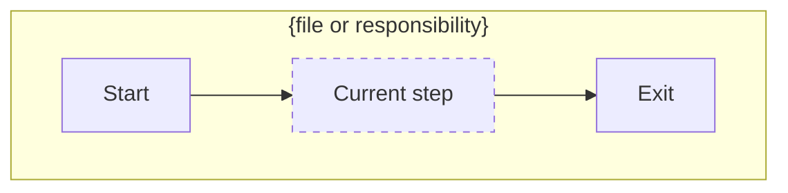
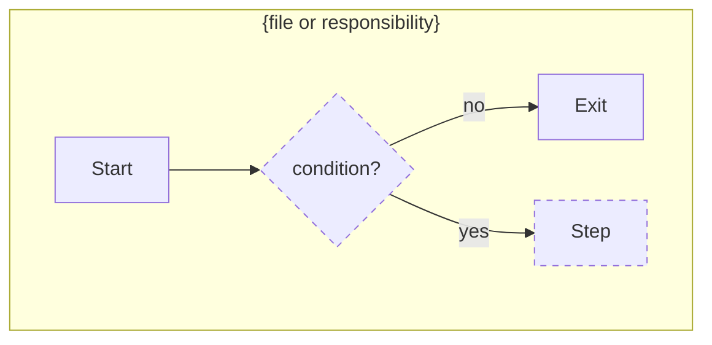

# Plan pattern

Defines **plan file structure only**. Stack rules live in the repo's `AGENTS.md` / `CLAUDE.md`.

## Workflow — always, no exceptions

1. **Write** the plan file with `## 1. Requirement` (short summary list of what the user needs), a first draft of `## 2. Understanding`, and an empty `## 8. Grilling Q&A`.
2. **Invoke the `grilling` skill.** One question at a time, each with a recommended answer. Explore the codebase instead of asking whatever the code can answer.
   - Every asked question gets a one-line row in §8 (question + short answer) — §8 is the Q&A record the user rechecks and can re-answer.
   - Answered → fold into its section (scope/constraints → §2, file effects → §3–§5, behavior/edge cases → §6, sequencing → §7).
   - User can't decide, or asks a question back → mark the §8 row as **open** with the context that blocked it; continue other branches.
   - Later resolved → replace the open marker with the answer.
3. **Fill** §2–§7. If §8 still has open rows, grill again on only those items.
4. **Report** — end the final message by telling the user where the plan file is: full path, stated plainly (e.g. `Plan saved at: /path/to/repo/feature.plan.md`). Never finish without it.

## Rules

- All 8 headings always render, in order. Empty ones get `None` — never delete a heading.
- §7 maps 1:1 to frontmatter `todos`. No orphan todos, no unlisted steps.
- §6's mermaid Before/After diagrams **are** the flow description — make them complete enough to stand alone (every step, branch, and exit named).
- §3–§5 all use the same ASCII-tree shape; §4 and §5 annotate each leaf (`— what changes` / `— why removed`).
- §6 shows **Before** (current flow) and **After** (planned flow) so the change is visible as a diff. Keep node IDs and layout identical where the flow is unchanged; mark added/modified nodes with `:::changed` (dashed). Greenfield work: Before is `None`, only After renders.
- Compact: tables, bullets, paths. Concrete names — no "etc." or "similar to existing". Complex plans get more *rows*, not longer *sentences*.

## Template

Everything below the rule is the plan template, shown as live markdown so it renders correctly. `{…}` marks a placeholder. The plan file starts with this frontmatter:

```yaml
---
name: {Plan title}
overview: {One sentence — what, scope, outcome. Never repeated in the body.}
todos:
  - id: {kebab-id}          # one per §7 step
    content: {actionable one-liner}
    status: pending
isProject: false
---
```

---

# {Plan title}

## 1. Requirement
{Short summary list of what the user needs — brief but understandable on its own.
One bullet per need, in the user's terms.}

## 2. Understanding
{What I understand I must do — from the requirement plus grilling answers.
Short clean list, not long text: scope, assumptions, constraints, prereqs (deps, data, config, access).
A misread should be catchable here.}

## 3. Files to create
{ASCII tree of new paths, grouped logically. Mark the entry/orchestrator file.}

```
src/
├── feature/
│   ├── index.ts        ← entry
│   └── helper.ts
└── feature.test.ts
```

## 4. Files to change
{ASCII tree like §3; each leaf annotated `— what changes, one line`.}

```
src/
├── app.ts              — register feature route
└── config.ts           — add FEATURE_FLAG env
```

## 5. Files to remove
{ASCII tree like §3; each leaf annotated `— why`.}

```
src/
└── legacy/
    └── old-feature.ts  — replaced by src/feature/
```

## 6. How it works

### Before (current flow)
{`None` for greenfield work — no diagram then.}



### After (planned flow)



### {Non-obvious rule}
{Optional subsection — only when the plan carries a special rule the flow can't show:
retry policy, idempotency, naming convention, or "done when…" completion criteria.
Omit this subsection when no such rule exists.}

## 7. Steps
1. {Foundation first, then dependents. Dependency-safe order.}

## 8. Grilling Q&A
{Every question asked during grilling, one row each — a short-read summary the user rechecks and can re-answer.}

| Question | Answer |
|---|---|
| {question, compressed} | {answer, one line} |
| {parked question} | **open** — {context / blocker} |
