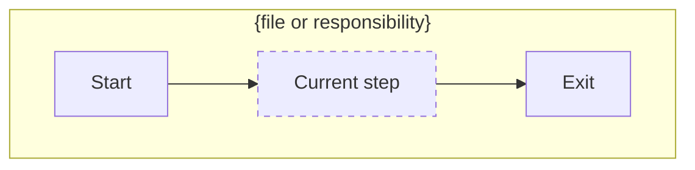
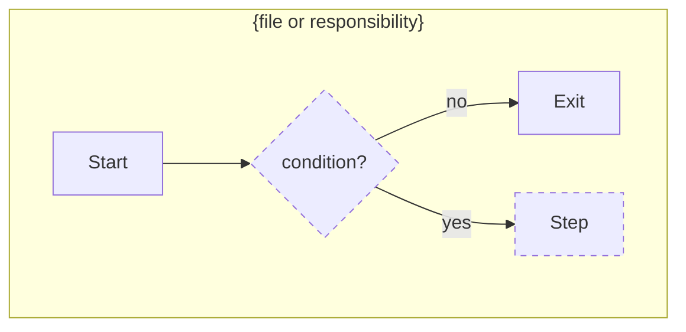

# Plan pattern

Plan **file structure only**. Stack rules live in the repo's `AGENTS.md` / `CLAUDE.md`.

## Workflow — always, no exceptions

1. **Write** the plan file: §1 Requirement (user's needs, short list), §2 Understanding with only **Current** filled from codebase exploration, §8 empty.
2. **Grill** — invoke the `grilling` skill. One question at a time, each with a recommended answer. Never ask what the code can answer.
   - Every question → one row in §8 (question + one-line answer).
   - Answered → fold into its section: what/how/scope → §2, file effects → §3–§5, behavior/edge cases → §6, sequencing → §7.
   - Undecided or user asks back → §8 row marked **open** with the blocker; continue other branches. Resolved later → replace the marker.
3. **Fill** §2–§7. Open §8 rows → grill again on those only.
4. **Report** — final message ends with the full path: `Plan saved at: /path/to/repo/feature.plan.md`. Never finish without it. Building it is `/plan-clean-structure`'s job.

## Rules

- All 8 headings render, in order. Empty → `None`. Never delete a heading.
- §2 has three fixed parts: **Current** (how the affected flow works today), **To do** (what + how), **Constraints**. **To do** is derived only from §1 + §8 — no scope without a source. **Current** is the short read; §6 Before is the full diagram — don't duplicate.
- §3–§5 share one ASCII-tree shape; §4/§5 annotate each leaf (`— what changes` / `— why removed`).
- §6 mermaid **Before**/**After** *is* the flow description — complete enough to stand alone (every step, branch, exit named). Same node IDs/layout where unchanged; added/modified nodes `:::changed`. Greenfield: Before = `None`.
- §7 ↔ frontmatter `todos` 1:1. No orphan todos, no unlisted steps.
- Last line of the file is its own absolute path (`Plan saved at: …`) so the plan can be found from any context.
- Compact: tables, bullets, paths. Concrete names — no "etc." / "similar to existing". Complex plans get more *rows*, not longer *sentences*.

## Template

`{…}` = placeholder. File starts with:

```yaml
---
name: {Plan title}
overview: {One sentence — what, scope, outcome. Never repeated in the body.}
todos:
  - id: {kebab-id}          # one per §7 step
    content: {actionable one-liner}
    status: pending
isProject: false
---
```

---

# {Plan title}

## 1. Requirement
{One bullet per need, in the user's terms. Readable on its own.}

## 2. Understanding
{Three fixed parts, bullets only. A misread must be catchable here.}

**Current** — how the affected flow/logic works today, from reading the code. `None` for greenfield.
- {entry point} → {step} → {step} → {exit} — one chain per path, in the code's own names
- {file/function}: {logic that matters to this plan — condition, data shape, side effect}

**To do** — what changes and how. Every bullet traces to a §1 need or §8 answer.
- {§1 need / §8 answer} → {what: concrete change} — {how: approach, one line}

**Constraints** — scope boundaries, assumptions, prereqs (deps, data, config, access).
- {out of scope / assumption / prereq}

## 3. Files to create
{ASCII tree of new paths, grouped logically. Mark the entry/orchestrator file.}

```
src/
├── feature/
│   ├── index.ts        ← entry
│   └── helper.ts
└── feature.test.ts
```

## 4. Files to change
{Same tree; each leaf `— what changes, one line`.}

```
src/
├── app.ts              — register feature route
└── config.ts           — add FEATURE_FLAG env
```

## 5. Files to remove
{Same tree; each leaf `— why`.}

```
src/
└── legacy/
    └── old-feature.ts  — replaced by src/feature/
```

## 6. How it works

### Before (current flow)
{`None` for greenfield — no diagram then.}



### After (planned flow)



### {Non-obvious rule}
{Optional — only for a rule the flow can't show: retry policy, idempotency, naming convention, "done when…" criteria. Omit otherwise.}

## 7. Steps
1. {Foundation first, then dependents. Dependency-safe order.}

## 8. Grilling Q&A
{One row per question asked — the record the user rechecks and can re-answer.}

| Question | Answer |
|---|---|
| {question, compressed} | {answer, one line} |
| {parked question} | **open** — {context / blocker} |

---
Plan saved at: {/absolute/path/to/this/file.plan.md}
